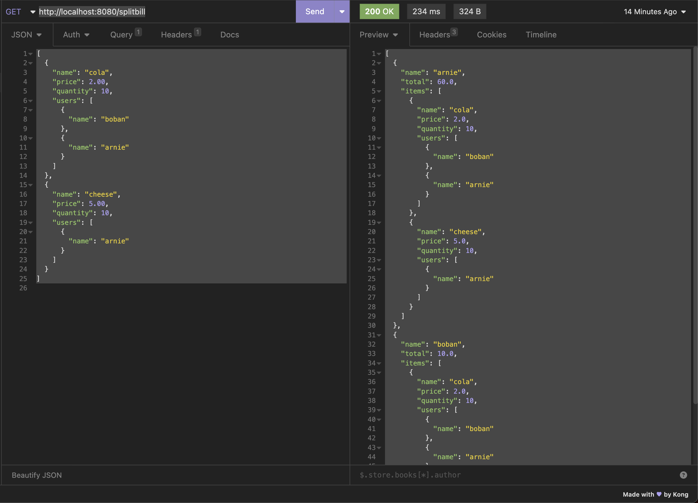

# Creating a Bill Splitter Service with Springboot

Hello! This is part of a Youtube Tutorial Series, where we explore building a Bill Splitter Service from scratch with Springboot and the Jackson JSON library!

## You can find the tutorial here
- https://www.youtube.com/watch?v=xyQDH0WqF1w&list=PLyUIbsA9Lw5bOByfh_oK2c6ghQ6xDUwGG&ab_channel=ShipItParrot

## Schematic


## Design Assumptions

1. We are interfacing with a Bill Splitter Telegram Chatbot, and they are sending us data like so.

- For simplicity, we will be assuming both the user and item names are unique, and use them as primary keys.

```
[
	{
		"name": "cola",     # name of item; we assume item names are unique
		"price": 2.00,      # price of each item
		"quantity": 10,     # quantity of each item
		"users": [
			{
				"name": "boban"     # name of user; we assume user names are unique
			},
			{
				"name": "arnie"
			}
		]
	},
	{
		"name": "cheese",
		"price": 5.00,
		"quantity": 10,
		"users": [
			{
				"name": "arnie"
			}
		]
	}
]
```

2. The Telegram bot will expect the output to be in this format

```
[
	{
		"name": "arnie",
		"total": 60.0,
		"items": [
			{
				"name": "cola",
				"price": 2.0,
				"quantity": 10,
				"users": [
					{
						"name": "boban"
					},
					{
						"name": "arnie"
					}
				]
			},
			{
				"name": "cheese",
				"price": 5.0,
				"quantity": 10,
				"users": [
					{
						"name": "arnie"
					}
				]
			}
		]
	},
	{
		"name": "boban",
		"total": 10.0,
		"items": [
			{
				"name": "cola",
				"price": 2.0,
				"quantity": 10,
				"users": [
					{
						"name": "boban"
					},
					{
						"name": "arnie"
					}
				]
			}
		]
	}
]
```


## Spinning up the Service 

This spins up the service on http://localhost:8080

```
mvn spring-boot:run
```

## Making a sample request to the service



```
GET http://localhost:8080/splitbill
```

JSON Input payload

```
[
	{
		"name": "cola",
		"price": 2.00,
		"quantity": 10,
		"users": [
			{
				"name": "boban"
			},
			{
				"name": "arnie"
			}
		]
	},
	{
		"name": "cheese",
		"price": 5.00,
		"quantity": 10,
		"users": [
			{
				"name": "arnie"
			}
		]
	}
]
```

Sample Output

```aidl
[
	{
		"name": "arnie",
		"total": 60.0,
		"items": [
			{
				"name": "cola",
				"price": 2.0,
				"quantity": 10,
				"users": [
					{
						"name": "boban"
					},
					{
						"name": "arnie"
					}
				]
			},
			{
				"name": "cheese",
				"price": 5.0,
				"quantity": 10,
				"users": [
					{
						"name": "arnie"
					}
				]
			}
		]
	},
	{
		"name": "boban",
		"total": 10.0,
		"items": [
			{
				"name": "cola",
				"price": 2.0,
				"quantity": 10,
				"users": [
					{
						"name": "boban"
					},
					{
						"name": "arnie"
					}
				]
			}
		]
	}
]
```
